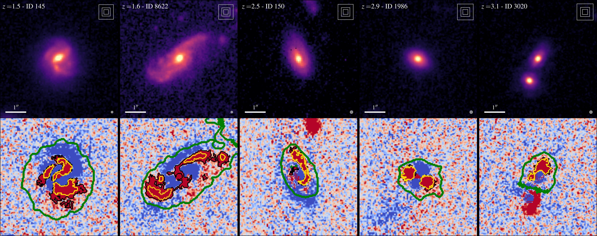

.. toctree::
    :hidden:
    :maxdepth: 2

    notebook/index
    API/index

Installation and dependencies
=============================

This software is **not** provided through pypi, conda, or uv. To use it, simply download it and put it into your path.
This software has been developped with python version 3.10 and with the following dependencies:

- `numpy <https://numpy.org/>`_ : 2.0.1
- `astropy <https://www.astropy.org/>`_ : 6.1.7
- `regions <https://astropy-regions.readthedocs.io/en/stable/index.html>`_ : 0.10
- `matplotlib <https://matplotlib.org/>`_ : 3.10.0

General description
===================

This is the documentation page for the 'clump finder' algorithm used in `Mercier et al. (2025) <https://arxiv.org/abs/2506.13881>`_. 
The code used in the paper can be found in the `associated repository <https://github.com/WilfriedMercier/clump_finder/tree/main>`_. 

The goal of the algorithm is to find contiguous structures of pixels in an image given that:

1. each pixel is brighther than a given threshold and
2. the contiguous structure is more extended than a given area.

   Examples of substructure detections.

This algorithm can be used to detect substructures in residual images as follows

.. code:: python

    from finder import ClumpFinder

    cf = ClumpFinder(
        image, mask, mask_bg, mask_bulge
    )

    cf.detect(model, flux_threshold, surface_threshold)

where :python:`image` is the cutout of the galaxy, :python:`model` is its 2D model (i.e. :python:`image - model` are the residuals), :python:`mask` is a boolean array selecting pixels associated to the galaxy, :python:`mask_bg` is a boolean array selecting pixels associated to background-dominated regions, :python:`mask_bulge` is an optional boolean array used to select and mask pixels within the central bulge, :python:`flux_threshold` is the flux threshold applied at the pixel level, and :python:`surface_threshold` is the surface threshold used to select contiguous substructures.

Modes of detection
==================

Two modes of detection were used in the paper:

1. An optimal detection whereby all substructures above user-defined flux and surface thresholds are detected. 
2. An intrinsic detection whereby the detection thresholds are varied as a function of redshift to allow the detection of substructures down to similar levels of physical area and intrinsic luminosity.

Optimal detection
^^^^^^^^^^^^^^^^^

In `Mercier et al. (2025) <https://arxiv.org/abs/2506.13881>`_, the optimal detection is carried out using a fixed surface threshold of :math:`20\,\rm pixels` and a :math:`2\sigma` flux threshold, where :math:`\sigma` is the standard deviation of the background pixels located around the galaxy.

We provide a function called :func:`~clump_finder.finder.background.bg_threshold_n_sigma` that calculates :math:`n \sigma` and that can be used to estimate the flux threshold for a given galaxy as follows

.. code:: python

    from finder import bg_threshold_n_sigma

    two_sigma = bg_threshold_n_sigma(
        image, model, mask_bg, 
        n_sigma = 2
    )

If :python:`image` corresponds to the residuals, then one can pass :python:`model = 0`. 
Instead, if one is interested in estimating the lowest flux threshold required to not detect any substructure in the background dominated regions around the galaxy (i.e. the optimal threshold), one can use the :func:`~clump_finder.finder.background.find_bg_threshold` as follows

.. code:: python

    from finder import find_bg_threshold

    lowest = find_bg_threshold(
        image, model, mask_bg, 20,
        positive  = True
        precision = 0.1
    )

Note that using :func:`~clump_finder.finder.background.find_bg_threshold` requires defining a surface detection threshold. 
Furthermore, the value may differ depending on whether one is interested in positive (over-densities in residuals) or negative (under-densities) substructures. 
Finally, this optimal threshold is found by dichotomy which stops after a given precision is reached. This precision may need to be adjusted based on the units of the image.

Intrinsic detection
^^^^^^^^^^^^^^^^^^^

The second detection method used in `Mercier et al. (2025) <https://arxiv.org/abs/2506.13881>`_ is the intrinsic one. This method has already been calibrated for the sample used in the paper and we provide the functions :func:`~clump_finder.finder.detection_curves.flux_detection_curve_pixel_level` and :func:`~clump_finder.finder.detection_curves.surface_detection_curve` to readily get the detection criteria used in the paper as a function of redshift.
We also provide the :func:`~clump_finder.finder.detection_curves.mag_detection_curve` function to estimate the magnitude of the faintest detectable substructure at a given redshift.

For instance, to reproduce Fig.B.3, one can use the following code:

.. jupyter-execute::

    from   finder import mag_detection_curve, surface_detection_curve
    import matplotlib.pyplot as plt
    import astropy.cosmology as cosmology
    import numpy as np
    
    cosmo = cosmology.FlatLambdaCDM(70, 0.3)
    z     = np.linspace(1, 4, 100)

    scrit = surface_detection_curve(z, cosmo)
    mcrit = mag_detection_curve(z, cosmo)

    f  = plt.figure(figsize=(6, 6))
    ax = f.add_subplot(111)
    ax.tick_params(direction='in', top=True)

    plt.plot(z, mcrit, color='k')
    plt.ylabel('Flux detection curve [AB mag]')

    # Showing surface criterion in 1e-3 arcsec^2
    ax2 = ax.twinx()
    ax2.tick_params(direction='in', right=True, left=False, color='firebrick', labelcolor='firebrick')
    ax2.spines['right'].set_color('firebrick')

    plt.plot(z, scrit * 1e3, color='firebrick', ls='--')
    plt.ylabel('Surface detection curve [$10^{-3}$ arcsec$^2$]', color='firebrick')
    plt.xlabel('Redshift')

    plt.xlim(1, 4)
    plt.show()